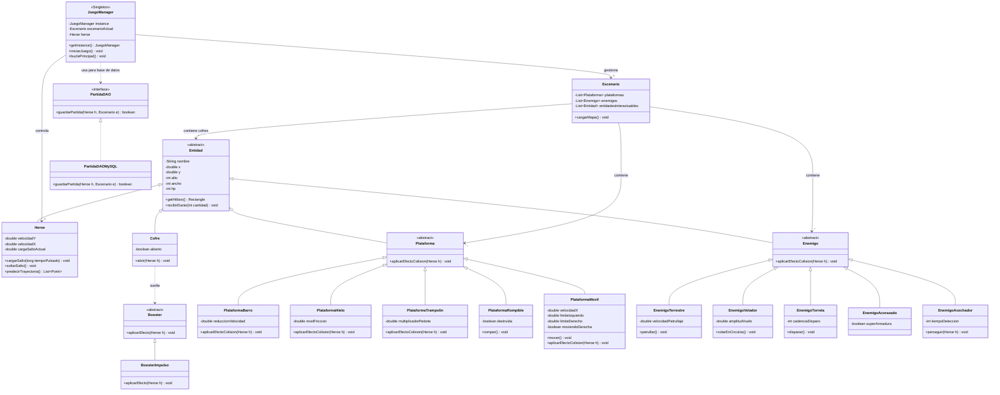

# Proyecto: Jumping Hero

## 1. Integrantes del Equipo 

- Cabrera, Joel. 
- Hidalgo,Lautaro.
- Millar,Juan Cruz.
- Valentino,Ernesto Paez.

## 2.Dominio y Alcance del Sistema.

###Descripcion del problema

Buscamos desarrollar una aplicacion de escritorio del juego Jump king. El jugador debera controlar al personaje usando el salto como su principal movimiento,subiendo las plataformas,esquivando enemigos y calculando los saltos ya que entre mas tiempo tenga pulsado el boton de salto la distancia sera mayor para llegar a la cima.

### Objetivo del Sistema.

El sistema sera un videojuego funcional desarrollado bajo el paradigma de Programa Orientado a Objetos(POO).Su diseño debe ser modular, asi se facilitara futuras incorporaciones de nuevos tipo de plataformas (ej: resbaladizas, rompibles,etc),comportamiento de enemigos y escenarios.Tambien se dara mucha importancia a la correcta implementacion de fisicas basicas(gravedad,calculo de trayectorias) y en la deteccion de colisones en tiempo real entre las distintas entidades del juego(Jugador - Enemigo-Escenario).

### Funcionalidades principales (Features).

- **Mecanicas del Jugador y Fisicas: **
-El jugador puede moverse horizontalmente.
-El sistema de salto sera dinamico, ya que la altura y distancia de la parabola se calcula en base al tiempo que se mantenga pulsado el boton de salto.
-Se aplica constante de gravedad y mecanicas de caida libre.

- **Entorno y Colisiones**
-Posicionamiento estatico de plataformas para crear  un mapa de progresion vertical.
-Sistema de deteccion de colisiones(hitboxes) preciso entre el jugador,los limites de la pantalla y las superficies de las plataformas.

- **Sistema de Obstaculos y Enemigos: **
-Generacion de entidades hostiles en el mapa con patrones de movimiento simple.
-Deteccion de colisiones con enemigos que penalicen al jugador (ej: interrumpiendo el salto, empujandolo hacia abajo o quitando vida).

-**Interfaz Grafica(IGU):**
-Renderizado visualdel personaje , los enemigos, las plataformas y el entorno.
-Indicador visual en pantalla (barra de potencia) que muestre la fuerza de carga del salto en tiempo real.

- **Condiciones de Juego: **
-Ausencia de Game over tradicional: el castigo por fallar es la perdida de progreso al caer o poner Game Over si aplicamos vidas.
-Condicion de victoria al alcanzar la plataforma mas alta del nivel.

- **Persistencia**
-Sistema de guardado y carga del estado de la pantalla.
-Almacenamiento local de los datos del jugador(como las coordenadas exactas del personaje) para permitir retomar el ascenso en sesiones futuras

## 3. Arquitectura y Diseño

### Diagramas de Diseño

#### **Diagrama de Clases UML (Conceptual)**

#### **Prototipo de la IGU (Wireframe)**

## 4. Stack Tecnológico

- **Lenguaje:** Java (Versión 17 o superior)
- **IDE:** Eclipse IDE
- **Persistencia de Datos:** Sistema de Archivos / Persistencia basada en Archivos Locales (para el guardado de la sesión y coordenadas).
- **Framework de IGU:** Java Swing 
- **Control de Versiones:** Git y GitHub

## 5. Herencia y Polimorfismo(Segunda Entrega)

1. Herencia (Para no repetir código)
Básicamente aplicamos herencia simple para no escribir mil veces los mismos atributos y mantener la arquitectura ordenada.

Sistema de Entidades: En vez de programarle la vida, el nombre y las coordenadas al Héroe y después hacer lo mismo de cero para el Enemigo, creamos una clase abstracta padre llamada Entidad. De ahí heredan Heroe y Enemigo, llevándose toda esa base y sumando solo sus mecánicas específicas.

Plataformas: Hicimos la misma jugada. Tenemos una clase base Plataforma que se encarga de lo genérico (dibujarse en pantalla, detectar colisiones). De ahí sacamos las clases hijas como PlataformaHielo o PlataformaBarro, que heredan toda la física base pero modifican cosas puntuales como la fricción o la velocidad del jugador.

2. Polimorfismo
Lo implementamos más que nada en el sistema de interacciones y colisiones para mantener el motor del juego limpio.
En lugar de armar una cadena enorme de if/else preguntando con qué tipo de bloque o entidad chocó el jugador, usamos un método general. Gracias a la sobrescritura en las clases hijas, cuando ocurre una colisión, es el propio objeto el que define qué efecto aplicar (por ejemplo, alterar la velocidad si es hielo ). De esta forma, el bucle principal del juego solo llama a la acción genérica, y si el día de mañana agregamos un obstáculo nuevo, no necesitamos modificar la lógica del motor, solo creamos la clase nueva.
